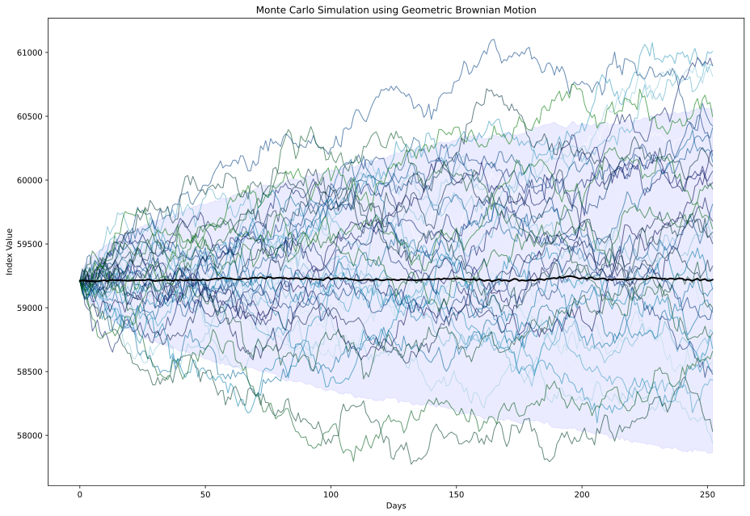

# Monte Carlo Simulation of NIFTY BANK Index (2015–2025)

## Overview

This repository presents an **applied probability and stochastic modeling study**
of the **NIFTY BANK index** using **Monte Carlo simulation**.  
The project focuses on **uncertainty quantification, distributional behavior,
and tail risk**, rather than deterministic price prediction.

Both **parametric (Geometric Brownian Motion)** and **non-parametric (bootstrap)**
Monte Carlo methods are employed to analyze how modeling assumptions influence
risk estimates in real-world financial time series.

## Repository Contents

| Description | File |
|------------|------|
| Jupyter notebook containing the complete Monte Carlo simulation, EDA, parameter estimation, and risk analysis | `Monte_Carlo_Simulation_of_NIFTY_BANK_Index_2015_2025.ipynb` |
| Detailed academic report with mathematical formulation, results, and interpretation | `Monte_Carlo_Simulation_of_NIFTY_BANK_Index_Research_Note.pdf` |
| Historical daily NIFTY BANK index data (2015–2025) | `niftybank2015-2025.csv` |
| Publication-quality figures (SVG format) | `figures/` |

## Motivation

Financial markets evolve under inherent randomness and external shocks.  
From a probabilistic standpoint, the goal is not to forecast a single outcome,
but to **characterize the distribution of possible future scenarios**.

Monte Carlo methods provide a principled framework for:
- modeling stochastic dynamics,
- studying variability and extreme events,
- comparing theoretical assumptions with empirical behavior.

## Key Features

### Data Cleaning & Preprocessing
- Conversion of price series to daily logarithmic returns
- Handling of missing values and trading-day alignment

### Exploratory Data Analysis (EDA)
- Historical price evolution
- Distribution of returns and volatility clustering
- Rolling volatility analysis
- Correlation structure among market variables

### Stochastic Modeling
- Estimation of drift and volatility parameters
- Monte Carlo simulation using discretized Geometric Brownian Motion
- Scenario generation over a one-year horizon

### Non-Parametric Bootstrap
- Resampling of empirical returns
- Preservation of skewness and fat-tailed behavior
- Distribution-free scenario generation

### Risk Quantification
- Value at Risk (VaR)
- Conditional Value at Risk (CVaR)
- Comparison across historical, GBM, and bootstrap approaches

## Dataset

- **Source:** National Stock Exchange of India (NSE)
- **Instrument:** NIFTY BANK Index
- **Time Period:** January 2015 – December 2025
- **Frequency:** Daily trading data

The dataset is used strictly for academic and research purposes.

## Key Concepts

- Monte Carlo simulation  
- Probability distributions  
- Brownian motion  
- Stochastic differential equations  
- Logarithmic returns  
- Bootstrap resampling  
- Tail risk  
- Value at Risk (VaR)  
- Conditional Value at Risk (CVaR)

## Results at a Glance

- GBM simulations produce smoother and narrower terminal distributions due to
  Gaussian assumptions.
- Bootstrap simulations exhibit heavier tails, leading to substantially higher
  VaR and CVaR estimates.
- Risk measures are highly sensitive to distributional assumptions, highlighting
  the importance of model choice in uncertainty quantification.

## Technologies Used
- Python (Pandas, NumPy, Seaborn, Matplotlib, scikit learn)
- Jupyter Notebook
  

## Author

**Chilivary Vishal**  
Integrated M.Sc. Mathematics  
National Institute of Technology Warangal

## License

This project is released under the **MIT License**.  
See the `LICENSE` file for details.

